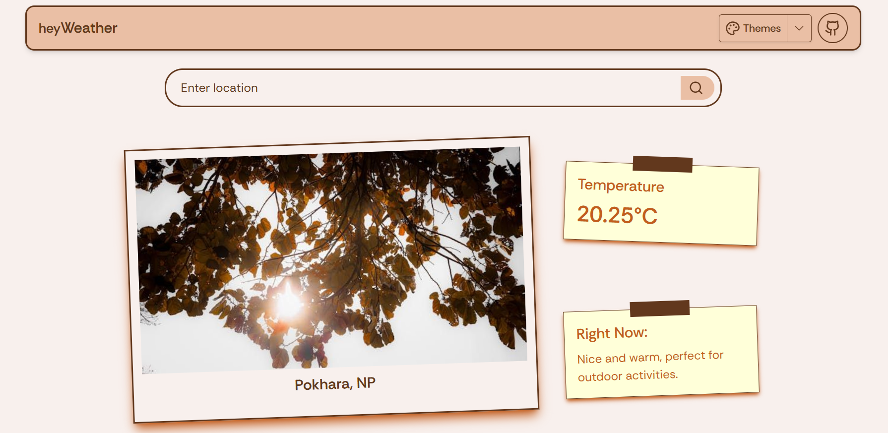
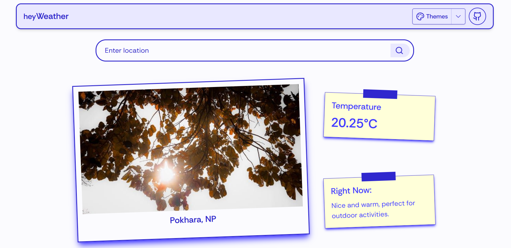

# HeyWeather

**HeyWeather** is a minimal and modern weather app built with **Next.js** and **TailwindCSS**.  
It features multiple theme options and a clean interface that provides:

- Current weather  
- 3-hour forecast  
- Daily weather  

Live Demo: [heyweather.vercel.app](https://weather.appwrite.network)

---

## Features

- Multiple theme options for a personalized look  
- Real-time weather data
- Smart search with city name suggestions for faster results
- 3-hour interval forecast  
- Daily forecast at a glance  
- Fully responsive and mobile-friendly  
- Built with **Next.js 13** and styled using **TailwindCSS**

---

## Tech Stack

- **Next.js** – React framework for SSR & static generation  
- **TailwindCSS** – Utility-first CSS framework  
- **OpenWeather API** (or the API used for data fetching)

---

## Contributing

Contributions, issues, and feature requests are welcome.  
Feel free to open an issue or submit a pull request.

---

## Preview

  
  
  

---

## License

This project is licensed under the MIT License – you are free to use and modify it.
